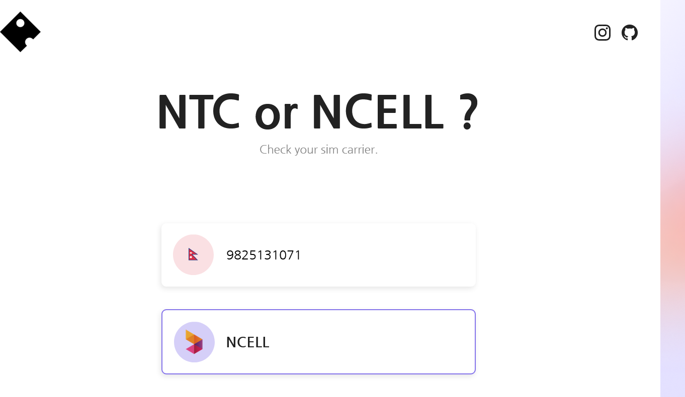

 

Check the carrier (NTC or Ncell) of mobile numbers in bulk using this tool. Supports XLS and CSV files for easy checking and exporting.

**how to use**

- visit the <a href="https://ncellorntc.vercel.app/" target="_blank"> website </a>
- Enter your number
  -For bulk number you can upload XLS and CSV file
- after checking you can also export the file
- yeah thats all
